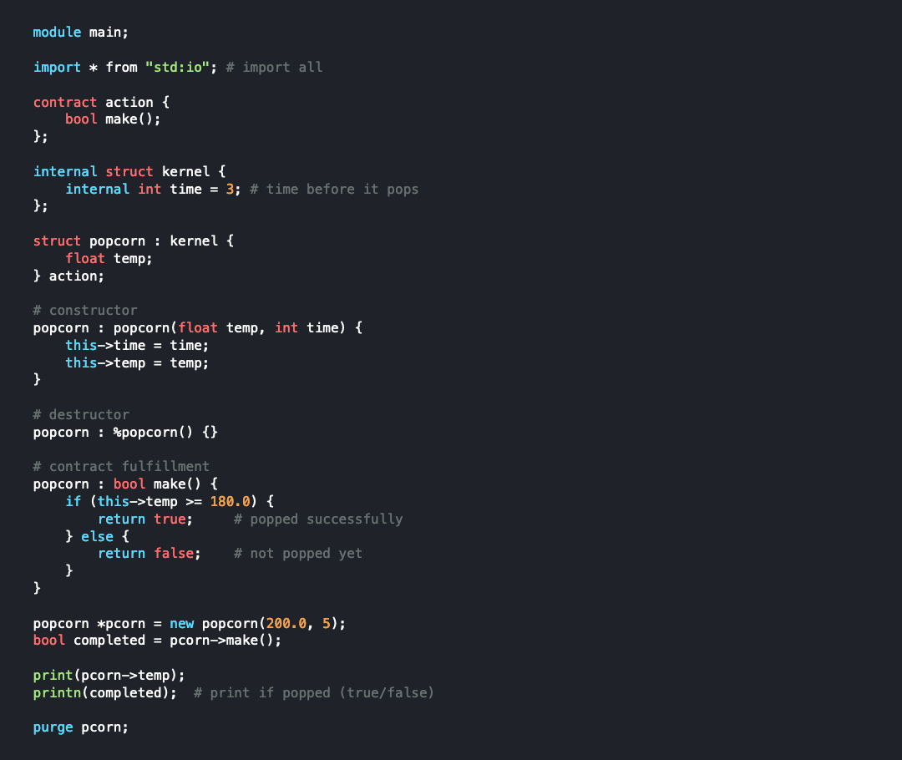

# 🌽 `corn`
*A statically typed, general-purpose programming language, crafted for simplicity and performance.*

"Trust the programmer" - `corn`

## About `corn`
 `corn` is a simple, efficient programming language designed for systems-level programming with a focus on manual memory management and minimalistic syntax. With `corn`, you have full control over system resources, offering maximum performance and clarity, without the overhead of complex language features. Whether you're developing performance-critical applications or need a low-level language with modern features like contract-based design, `corn` is built to meet those needs.

Explore the [documentation](https://sajibsrs.github.io/corn-lang/) and learn how `corn` can help you write clean, efficient, and performance-driven code.

