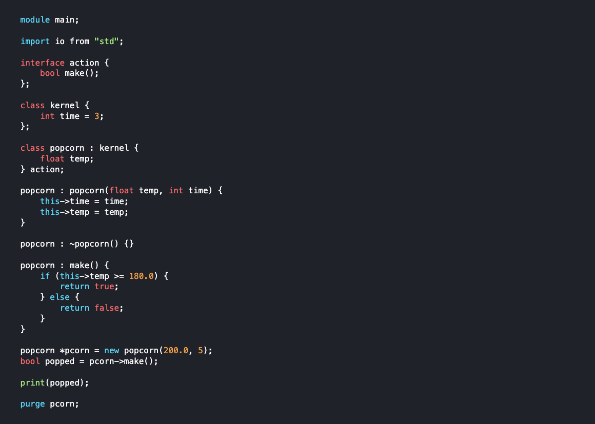

# `corx`
*A statically typed, general-purpose programming language, crafted for simplicity and performance.*

"Trust the programmer" - `corx`

## # About `corx`
 `corx` is a simple, efficient programming language designed for systems-level programming with a focus on manual memory management and minimalistic syntax. With `corx`, you have full control over system resources, offering maximum performance and clarity, without the overhead of complex language features. Whether you're developing performance-critical applications or need a low-level language with modern features like contract-based design, `corx` is built to meet those needs.

Explore the [documentation](https://sajibsrs.github.io/corx-lang/) and learn how `corx` can help you write clean, efficient, and performance-driven code.

## # Status
### 1. Lexer : complete(initial)
- [x] Create initial lexer
- [x] Recognize different tokens
- [x] Track line and column for every token
- [x] Handle different comment types
- [x] Handle undefined tokens
- [x] Error reporting
- [x] Testing

### 2. Parser : in-progress (initial))
- Create initial parser
    - [x] Context-free grammar (CFG), EBNF (Extended Backus-Naur Form)
    - [x] Implement recursive descent parsing
    - [x] Eliminate left-recursion
    - [x] Abstract Syntax Tree (AST)
    - [x] Error handling
    - [x] Error reporting
    - [ ] Testing
- [ ] REPL (Read-Eval-Print Loop)

### 3. Semantic Analysis
### 4. Intermediate Representation (IR)
### 5. Code Generation
### 6. Optimization
### 7. Documentation

---
**Note:** `corx` is currently under development. Its syntax and grammar are being finalized. The language design is still in progress, and a compiler has not yet been implemented.

